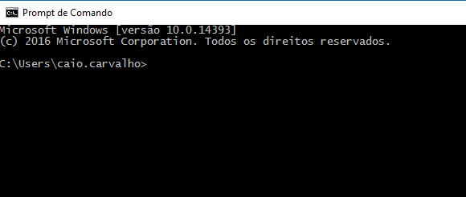

# Mark1
***Treinamento - William Galleti***
---
##Verificação de IP##
**Primeiramente, acessa-se o prompt de comando**

---
**No prompt comando, será executado o comando: ping -a**

---
**Identifica-se o IP**

---
**Executa-se (presionando ENTER)**

---
**A verificação de IP será concluída**